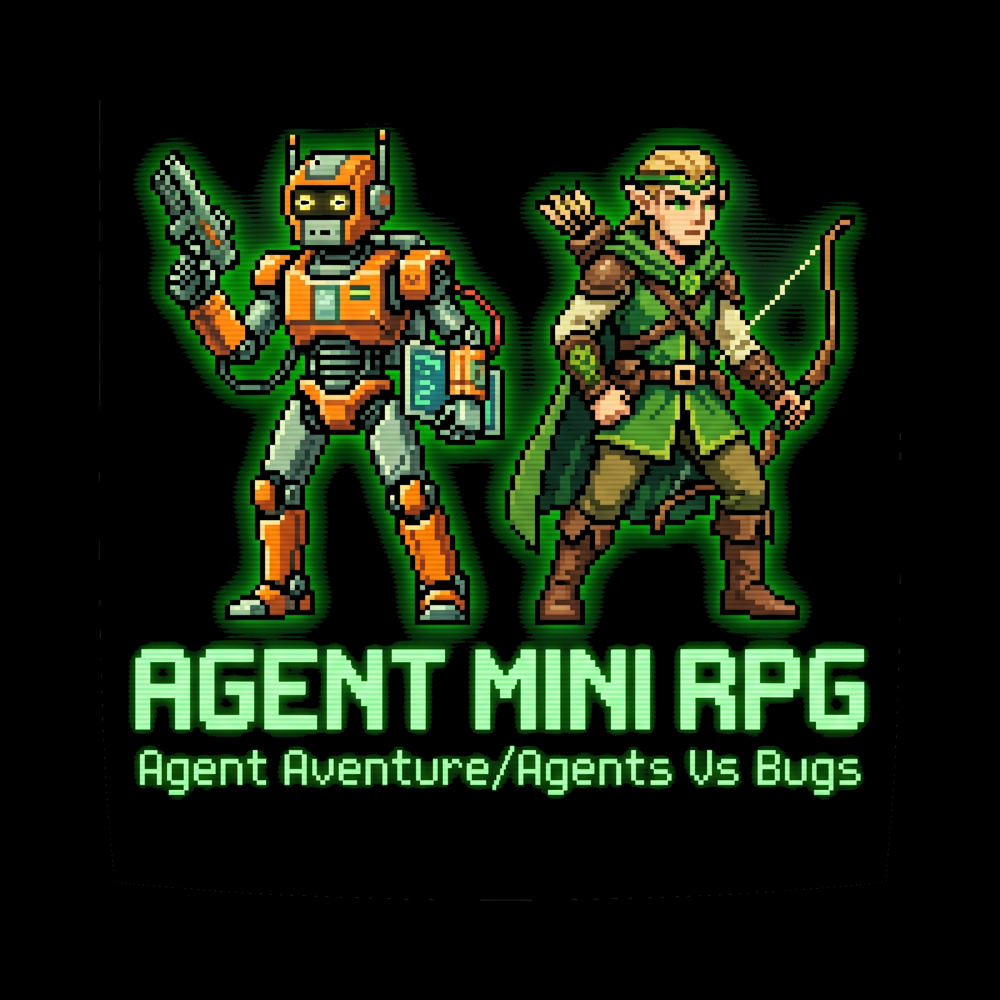
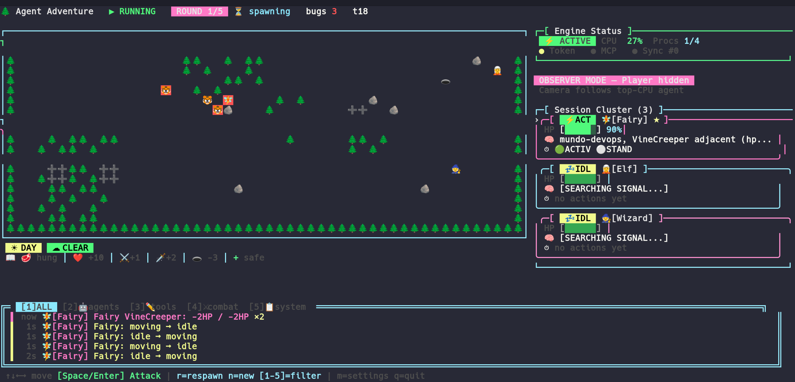
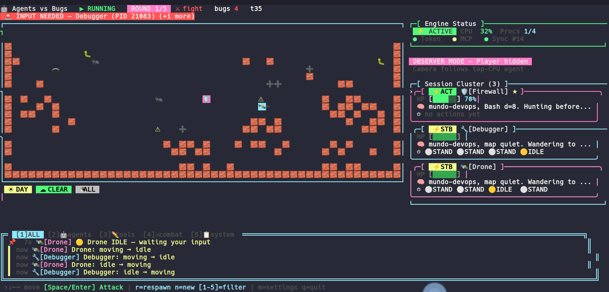

<div align="center">



# agents-mini-rpg

### 🤖 Terminal multi-agent RPG · powered by **Claude Code CLI** 🌲

[](https://www.npmjs.com/package/agents-mini-rpg)
[](https://github.com/Mundo-Dev0ps/agents-mini-rpg/actions/workflows/ci.yml)
[](./LICENSE)
[](https://nodejs.org)
[](https://www.typescriptlang.org)
[](./docs/COMPATIBILITY.md)
[](https://github.com/Mundo-Dev0ps/agents-mini-rpg/actions)
[](./docs/RELEASE.md)

<br/>

> **Every running Claude Code process becomes an in-game agent.**  
> The world freezes when no Claude is active — it literally mirrors your AI workflow in real time.

</div>

---

## 📸 Screenshots

<div align="center">

| 🌲 Adventure Mode | 🤖 Agents vs Bugs Mode |
|:-:|:-:|
|  |  |
| Forest fantasy · quests · beasts | Cyber-tech · bugs scale per round |

</div>

---

## ✨ What is this?

Terminal tile-grid RPG where **your Claude Code CLI sessions are the characters**.

```
  Claude editing a file  →  Agent moves toward resource
  Claude running Bash    →  Agent attacks a bug
  Claude spawning Task   →  Sub-agent appears on map
  Claude goes idle       →  World freezes, map dims
```

Connects via **MCP file-bridge** — real tool calls (`Edit`, `Bash`, `Read`, `Task`…) appear live in the event log. Game runs standalone without Claude too.

---

## 🎮 Features

| | |
|--|--|
| 🌲🤖 Two modes | *Adventure* (forest) and *Agents vs Bugs* (cyber-tech) |
| 🧝🧙🧚🛡️ 4 avatars per mode | Distinct stats, abilities, aura colors |
| ⚔️ Round-based progression | Enemies scale, boss waves, concurrent cap, deescalate |
| 📡 MCP live event log | Every Claude tool call appears in-game |
| 🧠 Process-aware engine | Tick freezes when all Claude PIDs go idle |
| 🔔 Input-needed alerts | Audio + blinking badge when Claude needs you |
| 👁️ Observer mode | Spectate agents, no player |
| 🌙 Night mode | Toggleable dim map + star overlay |
| ⬆️ Agent leveling | XP → level-up → full heal + stat boost |

---

## 🌲 Adventure Mode

<div align="center">

| Icon | Avatar | Ability |
|:----:|--------|---------|
| 🧝 | **Elf** | Elven Leap — phase through terrain |
| 🧙 | **Wizard** | Arcane Spell — remote heal on ally |
| 🧚 | **Fairy** | Magic Flight — fly over all obstacles |
| 🛡️ | **Knight** | Heroic Charge — pack hunt scan |

| Tier | Icons | Example names |
|:----:|:-----:|---------------|
| L1 | 🐺 🐯 | WildWolf, ForestSnake |
| L2 | 🐻 🦍 | ShadowBeast, MossOgre |
| L3 | 🦏 🐃 | RootGolem, FrostLynx |
| Boss | 🐗 🦏 🦣 🦖 🐲 | Named per wave |

</div>

---

## 🤖 Agents vs Bugs Mode

<div align="center">

| Icon | Avatar | Ability |
|:----:|--------|---------|
| 🤖 | **Robot** | Turbo-Deploy — x2 speed when BUSY |
| 🛰️ | **Drone** | Bypass — fly over walls |
| 🛡️ | **Firewall** | Block Packet — terrain bypass + block |
| 🔧 | **Debugger** | Remote Patch — heals nearby allies |

| Tier | Icons | Example names |
|:----:|:-----:|---------------|
| L1 | 🐛 🐜 | TimeoutError, TypeError |
| L2 | 👾 🦂 | RaceCondition, MemoryLeak |
| L3 | 🕷️ 🦠 | SegFault, InfiniteLoop |
| Boss | 🦟 🐉 🤖 👹 💀 | Named per wave |

</div>

---

## 🗺️ Map Tiles

<div align="center">

| Tile | Adventure | Bugs | Effect |
|:----:|-----------|------|--------|
| ❤️  | Heart | Heart | +10 HP |
| 🥩 / 🔋 | Meat | Battery | Refills hunger |
| ⚔️  | Weapon | Crate | ATK +1 |
| 🗡️  | Rare weapon | Hammer | ATK +2 |
| ➕ | Cure | Cure | Heals |
| 🕳️  | Trap | Trap | −3 HP |
| 💰 | Gold | Gold | Score |
| 🌲 | Tree | 🧱 Wall | Obstacle |
| 🪨 | Rock | 🧱 Wall | Obstacle |
| 🧱 | Brick wall | Brick wall | Built via `BUILD` |

</div>

---

## 🚀 Quick Start

### Install from npm

```bash
npm install -g agents-mini-rpg
agent-rpg
```

### Run from source

```bash
git clone https://github.com/Mundo-Dev0ps/agents-mini-rpg.git
cd agents-mini-rpg
npm install
npm run dev        # ts-node, no build step
```

> **Terminal size:** minimum **113×35**, recommended **140×42**.  
> The game shows a resize gate if your window is too small — just resize to dismiss.

On first launch: mode menu → avatar menu → game starts. Navigate with `↑/↓ ↵`, back with `b`, quit with `q`. Press `1`–`2` in mode menu or `1`–`6` in avatar menu for instant selection.

---

## ⌨️ Controls

| Key | Action |
|:---:|--------|
| `↑ ↓ ← →` | Move |
| `space` / `↵` | Interact (attack, pick up, talk) |
| `a` | Class ability |
| `r` | Respawn |
| `p` | Pause / resume |
| `i` / `tab` | Inspect agent panel |
| `m` / `esc` | Settings overlay |
| `1`–`2` / `1`–`6` | Quick-select in mode / avatar menus |
| `1`–`5` | Filter event log (in-game) |
| `s` | Toggle audio |
| `q` | Quit |

---

## 📚 Documentation

| Doc | Contents |
|-----|----------|
| [Compatibility](./docs/COMPATIBILITY.md) | Supported agents, OS, terminals, requirements, troubleshooting |
| [MCP Integration](./docs/MCP.md) | Setup, hook wiring, event log filters, privacy |
| [Settings & CLI Flags](./docs/SETTINGS.md) | In-game settings, `--flags`, env vars, audio |
| [Architecture](./docs/ARCHITECTURE.md) | Layer overview, design decisions, engine internals |
| [Release & Contributing](./docs/RELEASE.md) | CI, npm publish, adding agents/classes, PR guidelines |

---

## 📄 License

[MIT](./LICENSE) — © agents-mini-rpg contributors

---

<div align="center">

**Built with ❤️ for the Claude Code community**

⭐ Star this repo if it made your AI workflow more fun!

[](https://star-history.com/#Mundo-Dev0ps/agents-mini-rpg&Date)

</div>
